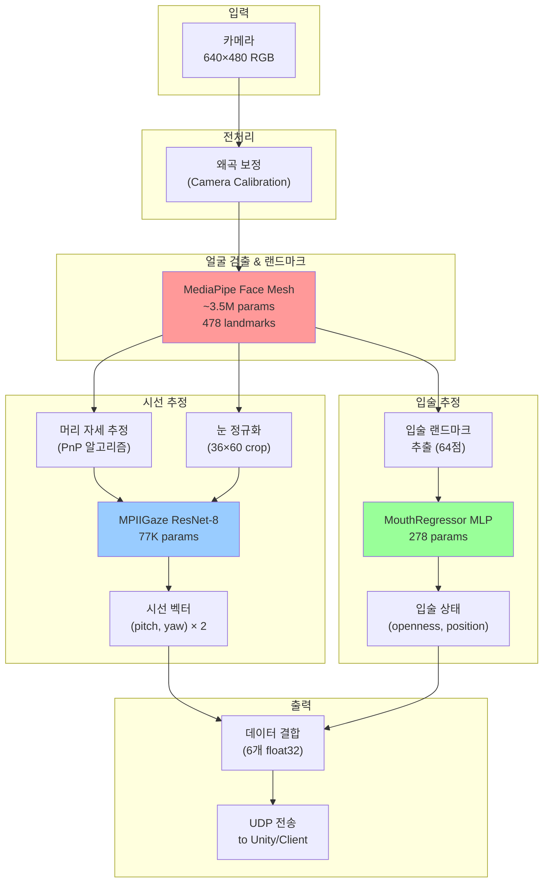
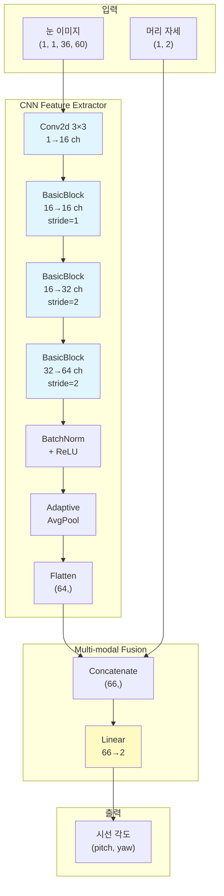
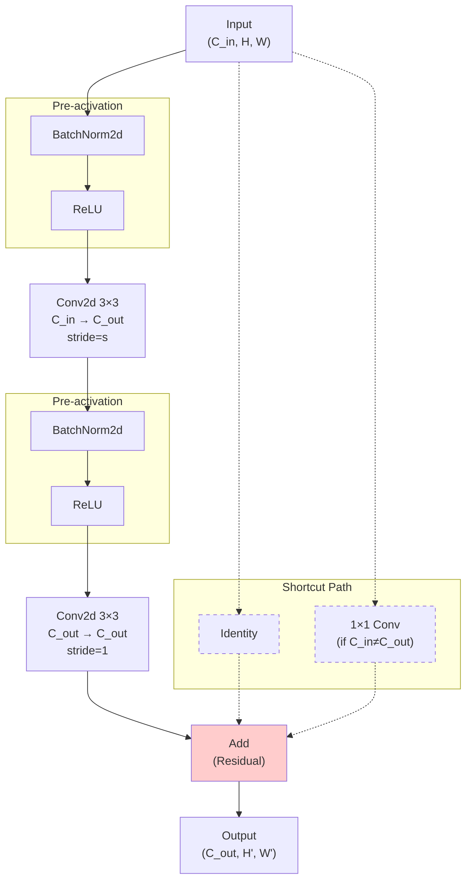
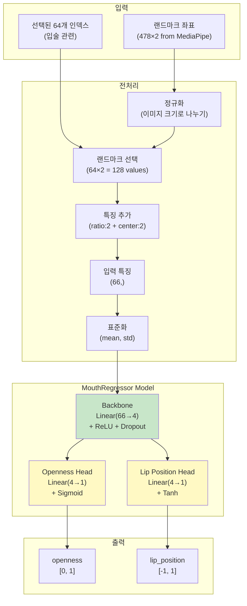
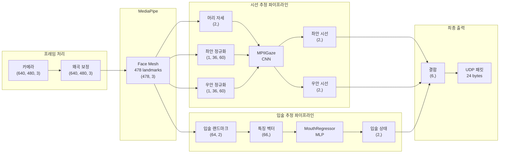
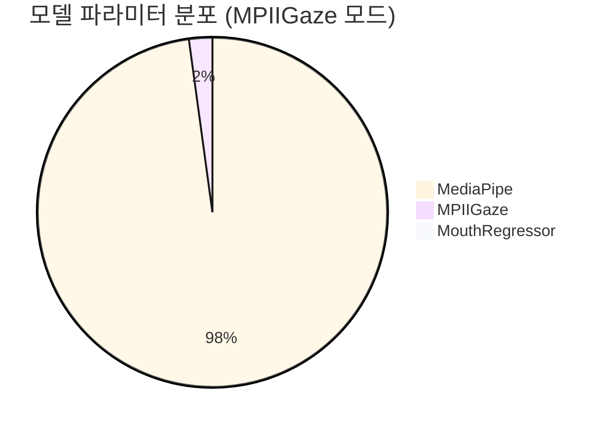
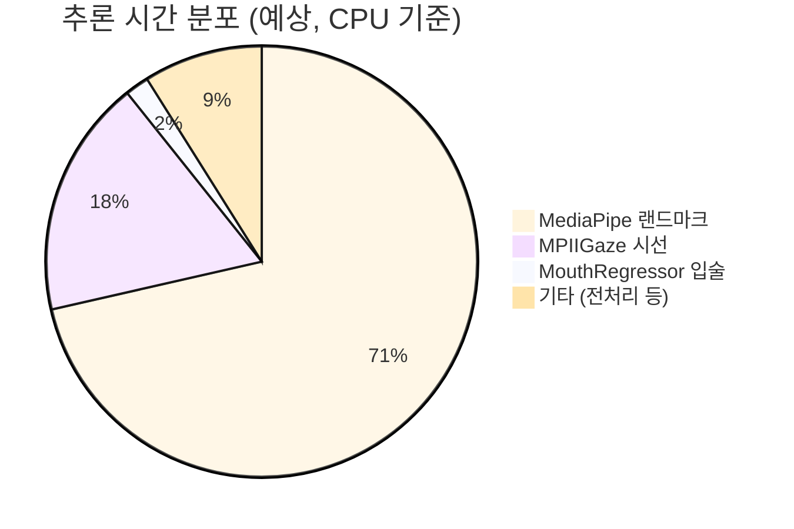

# 전체 파이프라인 구조 및 데이터 흐름도

## 1. 전체 시스템 구조 (High-level)

## 2. MPIIGaze 상세 구조

## 3. MPIIGaze BasicBlock 구조

## 4. MouthRegressor 상세 구조

## 5. 데이터 흐름 (Data Flow with Dimensions)

## 6. 성능 비교 (모델 크기)

## 7. 처리 시간 분포 (예상)

---

## 📝 주요 특징 요약

### MediaPipe Face Mesh
- **파라미터**: ~3.5M
- **입력**: RGB 이미지 (640×480)
- **출력**: 478개 3D 랜드마크
- **역할**: 얼굴 전체 랜드마크 추출 (눈, 입술 포함)

### MPIIGaze ResNet-8
- **파라미터**: 77,046
- **입력**: 눈 이미지 (1×36×60) + 머리 자세 (2D)
- **출력**: 시선 각도 (pitch, yaw) × 2 (양쪽 눈)
- **구조**: Pre-activation ResNet, 3-stage

### MouthRegressor MLP
- **파라미터**: 278
- **입력**: 선택된 입술 랜드마크 (64점) + 특징 (ratio, center)
- **출력**: openness [0,1], lip_position [-1,1]
- **구조**: 1-layer MLP with 2 heads

### 전체 시스템
- **총 파라미터**: ~3.58M (MediaPipe가 97.8%)
- **실시간 성능**: 30+ FPS (GPU/DML 사용 시)
- **출력 데이터**: 6개 float32 (24 bytes)
  - 좌안 시선 (2) + 우안 시선 (2) + 입술 (2)
